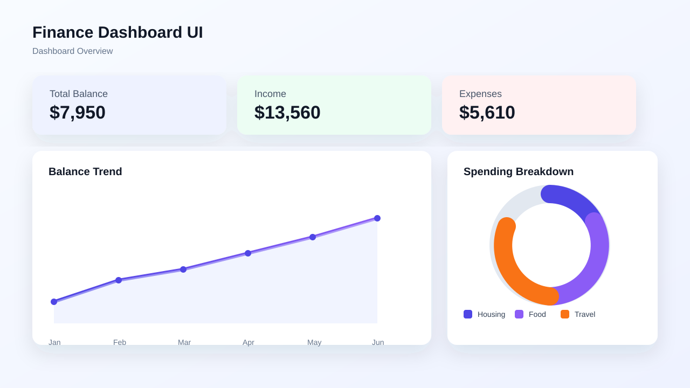
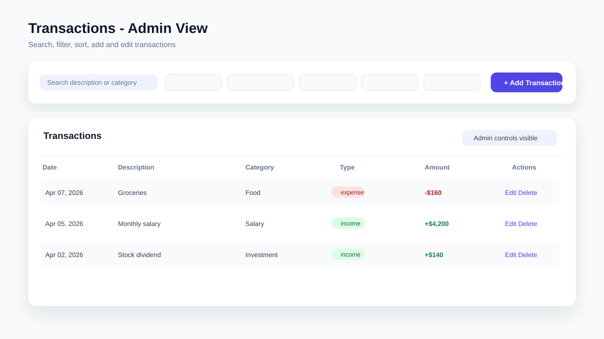
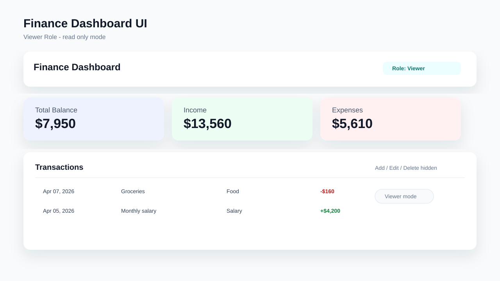

# Finance Dashboard UI

A frontend-only assignment project for tracking personal finance activity.

## Tech Stack

- React (JavaScript)
- Vite
- Context API + `useReducer`
- CSS (responsive layout)

## Implemented Features

- Dashboard overview cards: Total Balance, Income, Expenses
- Time-based visualization: balance trend chart
- Categorical visualization: spending breakdown by category
- Transactions table with date, amount, category, and type
- Search, filtering, and sorting controls
- Role-based UI simulation (`viewer` and `admin`)
- Admin-only add/edit/delete transaction actions
- Insights section:
  - Highest spending category
  - Monthly expense comparison
  - Average transaction value
- Empty states for no data / no filtered results
- Local storage persistence for transactions and selected role

## State Management

Global state is stored in `src/context/AppContext.jsx` and managed through a reducer:

- `transactions`
- `filters`
- `sort`
- `role`
- modal/editing UI state

## Run Locally

```bash
npm install
npm run dev
```

Open `http://localhost:5173`.

## Screenshots

Add screenshots inside `public/screenshots/` and reference them here:





## Project Structure

- `src/context/AppContext.jsx` — state/reducer and derived finance data
- `src/utils/finance.js` — summary, trend, breakdown, insights, formatting helpers
- `src/components/dashboard/*` — summary cards and visualizations
- `src/components/transactions/*` — toolbar, table, admin modal
- `src/components/insights/InsightsPanel.jsx` — insight cards
- `src/data/mockTransactions.js` — mock dataset

## Trade-offs

- No backend/auth; role behavior is intentionally simulated in UI
- Charts are custom lightweight SVG/CSS implementations (no chart library)
- Focused on clean structure and assignment scope over advanced analytics
